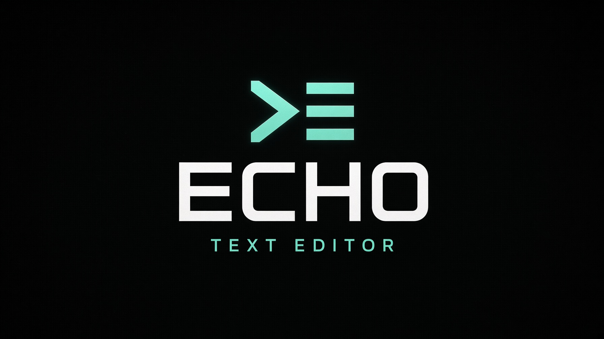

# ECHO Text Editor

**ECHO Text Editor (`ete`)** is a lightweight terminal text editor for Linux.
It brings familiar GUI-editor shortcuts to a single-file Python 3 application:
syntax highlighting, line numbers, mouse selection, undo/redo, find/replace,
auto-indentation, and word wrap. The editor uses Python's standard library and
does not need pip packages.



## Contents

- [Highlights](#highlights)
- [Requirements](#requirements)
- [Install](#install)
  - [Debian and Ubuntu](#debian-and-ubuntu)
  - [Fedora and RPM-based distributions](#fedora-and-rpm-based-distributions)
  - [Install from source](#install-from-source)
- [Run ECHO](#run-echo)
- [Editing guide](#editing-guide)
- [Keyboard shortcuts](#keyboard-shortcuts)
- [Mouse and clipboard](#mouse-and-clipboard)
- [Syntax highlighting](#syntax-highlighting)
- [Build packages](#build-packages)
- [Troubleshooting](#troubleshooting)

## Highlights

- Windows-style `Ctrl` shortcuts, including `Ctrl+C` to copy instead of sending
  an interrupt.
- Python, JavaScript, TypeScript, HTML, CSS, JSON, Markdown, C/C++, Shell,
  YAML, and additional syntax highlighting, recognized by extension or
  supported shebang.
- Shebang recognition updates as the first line is edited.
- Line numbers, cursor position, language, newline format, indentation style,
  and modified/saved state in the status bar.
- Automatic indentation, matching brackets, word wrap, and UTF-8 editing.
- Operation-based undo/redo, find and replace (including optional regular
  expressions), and mouse-driven cursor placement and selection.
- Atomic save when the filesystem supports it; existing file permissions are
  retained when replacing a file.
- One Python source file with no third-party runtime dependencies.

## Requirements

- Linux with Python 3.8 or newer.
- A real interactive terminal with a working `TERM` setting and `curses`.
- Optional clipboard commands: `wl-copy`/`wl-paste` for Wayland or `xclip` or
  `xsel` for X11.

On Debian or Ubuntu, if importing `curses` fails, install the matching
distribution package:

```bash
sudo apt install python3-curses
```

## Install

### Debian and Ubuntu

Download the `.deb` from the [ECHO releases page](https://github.com/ShadyDevelopment/ECHO-Text-Editor/releases).
For example, to install release 1.0.2-octa:

```bash
curl -LO https://github.com/ShadyDevelopment/ECHO-Text-Editor/releases/download/v1.0.2-octa/ete_1.0.2-octa_all.deb
sudo apt install ./ete_1.0.2-octa_all.deb
```

`apt` installs the package and its declared Python dependency. To remove it:

```bash
sudo apt remove ete
```

### Fedora and RPM-based distributions

Download the `.rpm` from the [ECHO releases page](https://github.com/ShadyDevelopment/ECHO-Text-Editor/releases).
For example, to install release 1.0.2-octa:

```bash
curl -LO https://github.com/ShadyDevelopment/ECHO-Text-Editor/releases/download/v1.0.2-octa/ete-1.0.2-1.octa.noarch.rpm
sudo dnf install ./ete-1.0.2-1.octa.noarch.rpm
```

On systems using `yum`, substitute `yum install` for `dnf install`. To remove
the package:

```bash
sudo dnf remove ete
```

### Install from source

Clone the repository, then run the per-user installer:

```bash
git clone https://github.com/ShadyDevelopment/ECHO-Text-Editor.git
cd ECHO-Text-Editor
bash public/install-ete.sh
```

The installer places `ete` at `~/.local/bin/ete` and does not require root.
Ensure `~/.local/bin` is on your `PATH`. For Bash, add this to `~/.bashrc`; for
Zsh, add it to `~/.zshrc`:

```bash
export PATH="$HOME/.local/bin:$PATH"
```

Open a new shell, or load the updated configuration:

```bash
source ~/.bashrc
```

Alternatively, install the standalone source directly:

```bash
install -Dm755 attachments/ete.py "$HOME/.local/bin/ete"
```

To upgrade a source installation, pull the repository changes and rerun
`bash public/install-ete.sh`.

## Run ECHO

Open or create a file:

```bash
ete filename.txt
```

Open at a particular line:

```bash
ete +42 src/main.py
```

The `+LINE` argument can appear before or after the filename. ECHO creates a
new buffer when the requested file does not exist. Use an absolute path or
`~/...` to open a file outside the current directory.

Without installing, run directly from the source checkout:

```bash
python3 attachments/ete.py [ +LINE ] [FILE]
```

Check the installed command or print its command-line help:

```bash
ete --version
ete --help
```

Press **F1** while editing for the in-editor shortcut reference. `Ctrl+Q`
quits; if the current buffer has unsaved edits, ECHO asks whether to save,
discard, or cancel.

## Editing guide

- **Create a file:** start `ete` without a filename, edit the buffer, and press
  `Ctrl+S`. ECHO asks for a path the first time it saves an unnamed buffer.
- **Save:** press `Ctrl+S`. `F2` opens Save As and asks before overwriting a
  different existing file.
- **Move around:** use the arrow keys, `Home`/`End`, `Page Up`/`Page Down`, or
  `Ctrl+G` to go to a line (or `line:column`).
- **Select text:** hold `Shift` with cursor keys, use `Ctrl+Shift` with the
  arrows for word-wise selection, or drag with the mouse.
- **Undo and redo:** `Ctrl+Z` and `Ctrl+Y`. Consecutive typed characters and
  backspaces are grouped into convenient undo steps.
- **Indent:** `Tab` inserts the detected indentation. Select multiple lines
  and press `Tab` to indent the block; use `Shift+Tab` to unindent.
- **Find:** press `Ctrl+F`, type a query, and press `Enter` or `F3` to move to
  the next match. `Shift+F3` searches backward.
- **Replace:** press `Ctrl+R`. Use `Tab` to switch between find and replace
  fields; `Enter` replaces the current match and `Ctrl+R` replaces all
  matches. In the find dialog, `Ctrl+T` toggles case-sensitive matching and
  `Ctrl+E` toggles regular-expression mode.
- **Toggle wrapping:** press `Ctrl+W` (or `Alt+Z`) to switch between wrapped
  lines and horizontal scrolling.
- **Quit:** press `Ctrl+Q`; answer the unsaved-changes prompt with `Y`, `N`, or
  `C` (yes, no, cancel).

ECHO reads and writes UTF-8 text while using `surrogateescape` to preserve
otherwise invalid UTF-8 bytes. Existing LF or CRLF line endings and whether the
file ends with a newline are retained when saving.

## Keyboard shortcuts

| Shortcut                         | Action                                    |
| -------------------------------- | ----------------------------------------- |
| `Ctrl+C` / `Ctrl+X` / `Ctrl+V`   | Copy / cut / paste                        |
| `Ctrl+Z` / `Ctrl+Y`              | Undo / redo                               |
| `Ctrl+A`                         | Select all                                |
| `Ctrl+S` / `F2`                  | Save / Save As                            |
| `Ctrl+F` / `Ctrl+R`              | Find / find and replace                   |
| `F3` / `Shift+F3`                | Find next / previous                      |
| `Ctrl+Q`                         | Quit, prompting if the buffer is modified |
| `Ctrl+G`                         | Go to line or `line:column`               |
| `Ctrl+W` / `Alt+Z`               | Toggle word wrap                          |
| `Tab` / `Shift+Tab`              | Indent / unindent                         |
| `Ctrl+/`                         | Toggle line comment when supported        |
| `Ctrl+D` / `Ctrl+L`              | Duplicate / delete line                   |
| `Alt+Up` / `Alt+Down`            | Move current line or selected lines       |
| `Ctrl+Backspace` / `Ctrl+Delete` | Delete previous / next word               |
| `F1`                             | Show help                                 |

With no selection, `Ctrl+C` copies the current line and `Ctrl+X` cuts it.
`Ctrl+V` pastes. ECHO uses raw terminal mode so `Ctrl+C` reaches the editor as
a copy command rather than terminating the process.

## Mouse and clipboard

In terminals that report mouse events, click to place the cursor, drag to
select, double-click a word, triple-click a line, and use the scroll wheel to
move through the buffer. Mouse reporting support varies by terminal emulator
and remote terminal.

When available, ECHO uses `wl-copy`/`wl-paste`, `xclip`, or `xsel` for the
system clipboard. It also keeps an internal clipboard and attempts OSC 52
copying as a terminal fallback (which may be disabled by the terminal or SSH
client). Without a clipboard provider, copying remains available for pasting
within the same ECHO process.

## Syntax highlighting

ECHO detects languages from file extensions and, when no known extension
matches, supported first-line shebangs. Highlighting includes Python,
JavaScript, TypeScript, HTML, CSS, JSON, Markdown, C, C++, Shell, YAML, SQL,
Go, Rust, Java, XML, TOML/INI, Lua, Ruby, Makefiles, and Dockerfiles.

For a new extensionless script, begin with a recognized shebang, for example:

```python
#!/usr/bin/env python3
```

As the first line is edited, ECHO re-detects its language and refreshes syntax
highlighting.

## Build packages

From the repository root on Debian or Ubuntu, install the packaging tools and
build both package formats:

```bash
sudo apt update
sudo apt install dpkg-dev rpm
bash packaging/build-packages.sh 1.0.2-octa
```

The script places `ete_1.0.2-octa_all.deb` and
`ete-1.0.2-1.octa.noarch.rpm` in `dist/`. Debian keeps the full version; RPM
stores the numeric portion as its version and the `octa` suffix as its
release.
An alternate output directory can be passed as the second argument:

```bash
bash packaging/build-packages.sh 1.0.2-octa "$HOME/build/ete"
```

These are architecture-independent packages. A `v*` tag runs the GitHub
Actions release workflow, which builds the `.deb` and `.rpm` on Linux and
attaches them to a GitHub Release. Each package has a Sigstore keyless signature
bound to the GitHub Actions release workflow and a SHA-256 checksum in
`SHA256SUMS`. Verify the signatures and checksums with Cosign and `sha256sum`:

```bash
cosign verify-blob \
  --bundle ete_1.0.2-octa_all.deb.sigstore.json \
  --certificate-identity 'https://github.com/ShadyDevelopment/ECHO-Text-Editor/.github/workflows/release.yml@refs/tags/v1.0.2-octa' \
  --certificate-oidc-issuer 'https://token.actions.githubusercontent.com' \
  ete_1.0.2-octa_all.deb
cosign verify-blob \
  --bundle ete-1.0.2-1.octa.noarch.rpm.sigstore.json \
  --certificate-identity 'https://github.com/ShadyDevelopment/ECHO-Text-Editor/.github/workflows/release.yml@refs/tags/v1.0.2-octa' \
  --certificate-oidc-issuer 'https://token.actions.githubusercontent.com' \
  ete-1.0.2-1.octa.noarch.rpm
sha256sum --check SHA256SUMS
```

The Linux packages contain only the `ete` executable and its README
documentation; repository tests, fixtures, and development tooling are not
installed. Check the releases page for the latest published binaries.

## Troubleshooting

### `ete: must be run in an interactive terminal`

ECHO is a full-screen terminal application; launch it from a terminal emulator
or a compatible SSH session, not from a pipe, redirected input, or a
non-interactive task runner.

### `No module named '_curses'` or `curses` import error

Install your distribution's Python curses package (for example,
`sudo apt install python3-curses` on Debian/Ubuntu), and ensure it matches the
Python interpreter used to launch ECHO.

### `ete: command not found`

Confirm `~/.local/bin` is on `PATH`, then open a new shell or source the
appropriate shell profile. Check the executable with:

```bash
ls -l "$HOME/.local/bin/ete"
printf '%s\n' "$PATH"
```

You can also run the installed file by its full path:

```bash
"$HOME/.local/bin/ete" filename.txt
```

### Clipboard does not reach other applications

Install and test the clipboard utility for your desktop session (`wl-clipboard`
for Wayland, or `xclip`/`xsel` for X11). Terminals can disable OSC 52 clipboard
access; ECHO's internal clipboard continues to work within the editor.

### Colors or mouse input are unavailable

Use a terminal emulator with color and mouse-reporting support and verify that
`TERM` names a compatible terminal (for example, `xterm-256color`). SSH
clients, multiplexers, and terminal settings can limit mouse reporting or
clipboard access.

## Project files

- `attachments/ete.py` — standalone CLI editor source.
- `public/ete.py` — downloadable copy of the CLI editor.
- `public/install-ete.sh` — per-user installer for the downloadable source.
- `packaging/build-packages.sh` — Debian/RPM package builder.
